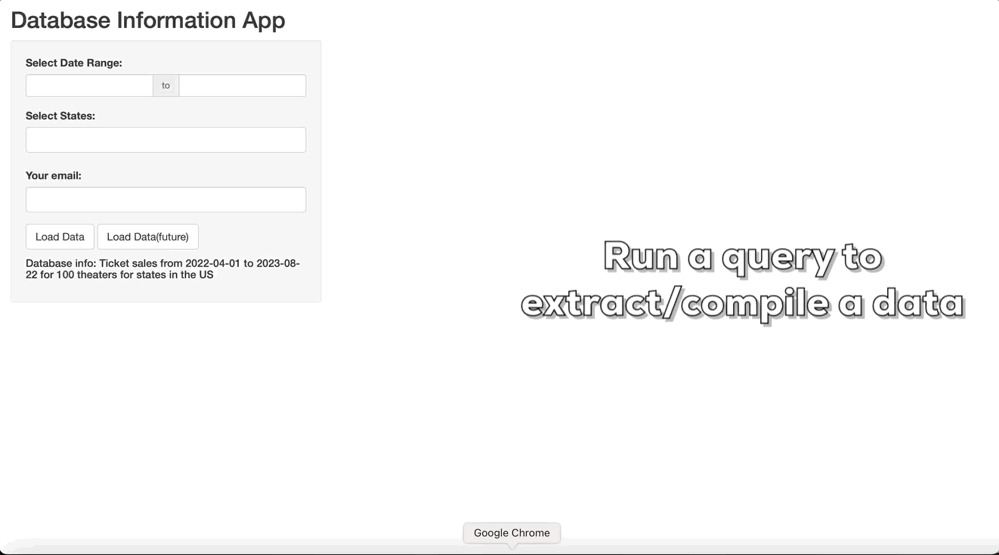
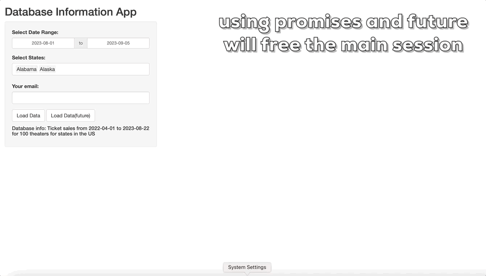

# shiny_query

In most companies, the data requests will be handled by data teams as the access for databases are limited and most stakeholders do not know how to write SQL code. Thus, data team would get multiple requests that share the SQL structure but not the same parameter. This is where Shiny would come in. We can use Shiny app to serve as the middle man to offer a controlled access to the database and allow users to directly get results that would normally come through as a request.

## Features

+ Minimal example of using Shiny to query databases.
+ Minimal example of using Shiny to query databases asynchronously(multiple users can submit a query at the same time without blocking the session).

## Example uses

1. Running a query 

2. User will be blocked if a query is taking longer time to run.

3. Unblock the shiny session with `promises` and `future`

